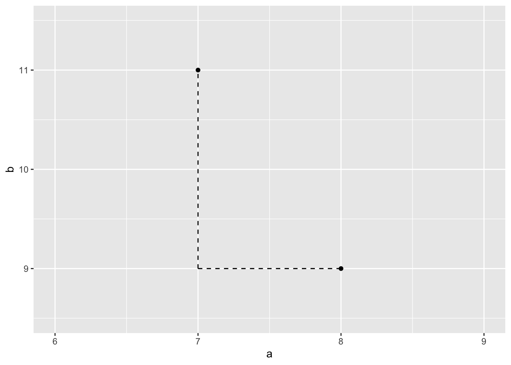
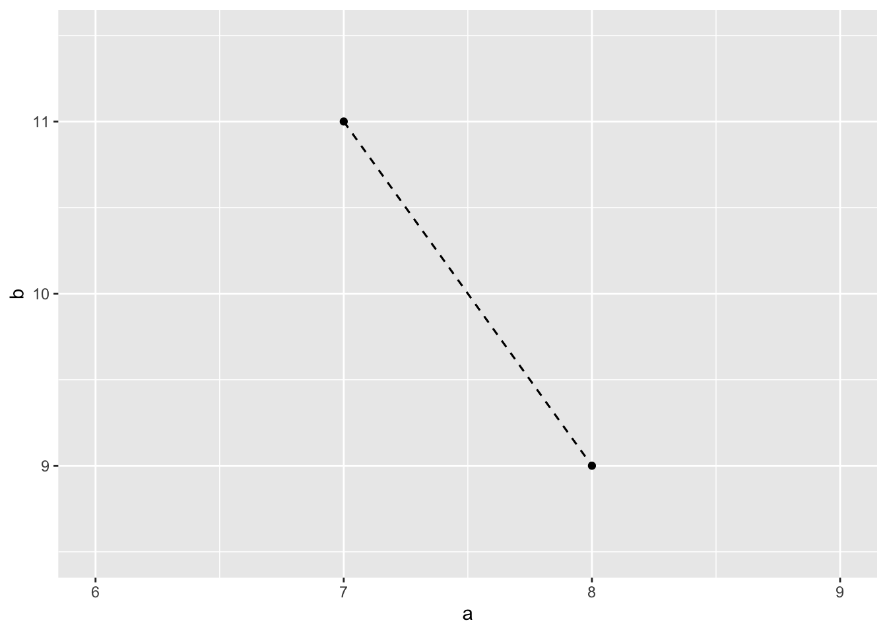
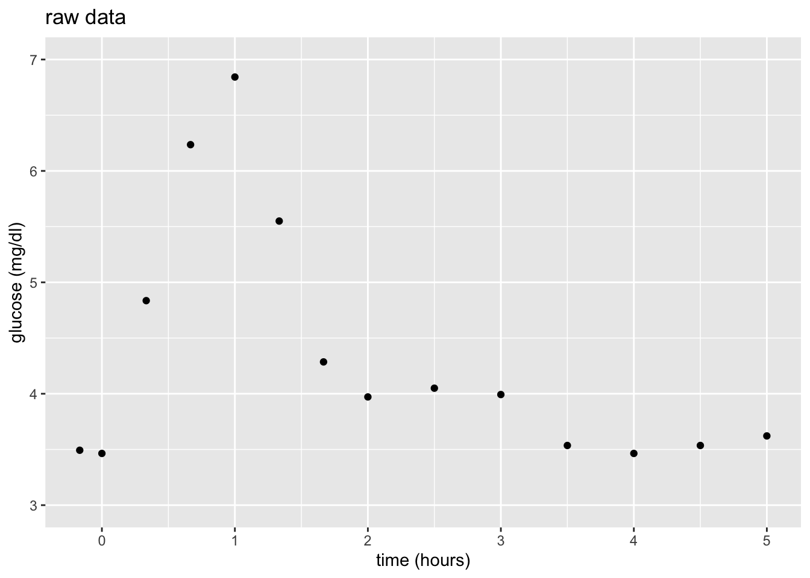

# Settling In {.unnumbered .smaller}

- Sit with your NEW assigned group
  - Introduce yourselves!
- Prepare to take notes
- Check Slack for announcements about upcoming events
- Locate and familiarize yourself with your Individual Feedback Tracker

## Homework Feedback and Revisions {-}

TBD


<!--
# Learning Goals {.unnumbered .smaller}
-->

# Notes: Nonparametric v. Parametric {.unnumbered .smaller}

## Context {.unnumbered .smaller}


<center>

</center>


- **world = supervised learning**       
    We want to model some output variable $y$ using a set of potential predictors ($x_1, x_2, ..., x_p$).

- **task = regression**       
    $y$ is quantitative

- **model = nonparametric regression???**       


## Goal {.unnumbered .smaller}

Just as in Unit 2, Unit 3 will focus on *model building*, but a different aspect:

- Unit 2: how do we handle / select predictors for our predictive model of $y$?
- Unit 3: how do we handle situations in which linear regression models are too *rigid* to capture the relationship of $y$ vs $x$?


  


## Motivating Example {.unnumbered .smaller}

Let's build a **predictive model** of blood `glucose` level in mg/dl by `time` in hours ($x$) since eating a high carbohydrate meal. 

Consider 3 **linear regression models** of $y$, none of which appear to be very good:

$$\begin{array}{ll}
\text{linear:} &  y = f(x) + \varepsilon = \beta_0 + \beta_1 x + \varepsilon \\
\text{quadratic:} & y = f(x) + \varepsilon = \beta_0 + \beta_1 x + \beta_2 x^2 + \varepsilon \\
\text{6th order polynomial:} & y = f(x) + \varepsilon = \beta_0 + \beta_1 x + \beta_2 x^2 + \beta_3 x^3 + \beta_4 x^4 + \beta_5 x^5 +  \beta_6 x^6 + \varepsilon \\
\end{array}$$


::: {.cell}
::: {.cell-output-display}
{width=768}
:::
:::


<!--  -->


<br>

**Parametric vs Nonparametric**

These **parametric** linear regression models assume (incorrectly) that we can represent glucose over time by the following formula for $f(x)$ that depends upon *parameters* $\beta_i$:
    
$$y = f(x) + \varepsilon = \beta_0 + \beta_1x_1 + \cdots + \beta_p x_p + \varepsilon$$

**Nonparametric** models do NOT assume a parametric form for the relationship between $y$ and $x$, $f(x)$. Thus they are more *flexible*.
    
    
<br>


# Exercises {-}

<!--## Directions {.unnumbered .smaller}-->

Be kind to yourself/each other and **work as a group**!


## Part 1: Intuition {.unnumbered .smaller}


1.  **Make some nonparametric predictions**    
    Working as a *group*, thinking nonparametrically, and utilizing the plot and data on the sheet provided, predict glucose level after:
    - 1.5 hours
    - 4.25 hours
    - $x$ hours (i.e. what's your general prediction process at any time point $x$?)
    
    
<details>
<summary>Solution</summary>
Will vary by group.
</details>
<br>


2. **Build a nonparametric algorithm**    
    Working as a *group*:
    - Translate your prediction process into a formal **algorithm**, i.e. step-by-step procedure or recipe, to predict glucose at any time point $x$. THINK:        
        - Does this depend upon any *tuning parameters*? For example, did your prediction process use any assumed "thresholds" or quantities?
        - If so, represent this tuning parameter as "t" and write your algorithm using t (not a tuned value for t).
    - On the separate page provided, one person should summarize this algorithm and report the predictions you got using this algorithm.

<!--  -->

<details>
<summary>Solution</summary>
Will vary by group.
</details>
<br>


3. **Test your algorithm**        
    Exchange algorithms with another group.
    - Is the other group's algorithm similar to yours?
    - Use their algorithm to predict glucose after 1.5 hours and 4.25 hours. Do your calculations match theirs? If not, what was unclear about their algorithm that led to the discrepancy?


<details>
<summary>Solution</summary>
Will vary by group.
</details>
<br>


<!-- nudge toward thinking about windows -->
<!-- how do we pick window size?   what are we doing within each window?     -->

4. **Building an algorithm as a class**       
    a. On your sheet, sketch a predictive model of glucose by time that a "good" algorithm would produce.
    b. In general, how would such an algorithm work? What would be its *tuning parameter*?


<details>
<summary>Solution</summary>
a. smooth curve that follows the general trend
b. *tuning parameter* = size of the windows or neighborhoods. in general, we'll fit "models" within smaller windows
</details>
<br>    
    


## Part 2: Distance {-}

Central to nonparametric modeling is the concept of using data points within some local *window* or *neighborhood*.
And defining a local window or neighborhood relies on the concept of *distance*.

With only one predictor, this was straightforward in our glucose example: the closest neighbors at time $x$ are the data points observed at the *closest* time points.

\
\


**GOAL**

Explore the idea of *distance* when we have more predictors, and the data-preprocessing steps we have to take in order to implement this idea in practice.


\
\


5. **Two measures of distance**       
    Consider data on 2 predictors for 2 students:
    
- student 1: 8 hours sleep Monday ($a_1$),  9 hours sleep Tuesday ($b_1$)
- student 2: 7 hours sleep Monday ($a_2$), 11 hours sleep Tuesday ($b_2$)
    
a. Calculate the Manhattan distance between the 2 students. And why do you think this is called "Manhattan" distance?        
        
$$|a_1 - a_2| + |b_1 - b_2|$$
        

::: {.cell}

:::

::: {.cell}
::: {.cell-output-display}
{width=672}
:::
:::

        
        
        
        
b. Calculate the Euclidean distance between the 2 students:       
        
$$\sqrt{(a_1 - a_2)^2 + (b_1 - b_2)^2}$$        
        

::: {.cell}

:::

::: {.cell}
::: {.cell-output-display}
{width=672}
:::
:::

        
        
      

**NOTE:** We'll typically use Euclidean distance in our algorithms. But for the purposes of this activity, use Manhattan distance (just since it's easier to calculate and gets at the same ideas).


<details>
<summary>Solution</summary>

::: {.cell}

```{.r .cell-code}
# a
abs(8 - 7) + abs(9 - 11)
```

::: {.cell-output .cell-output-stdout}

```
[1] 3
```


:::

```{.r .cell-code}
# b
sqrt((8 - 7)^2 + (9 - 11)^2)
```

::: {.cell-output .cell-output-stdout}

```
[1] 2.236068
```


:::
:::

</details>
<br>


6. **Who are my neighbors?**        
    Consider two more possible predictors of some student outcome variable $y$:
    
- $x_1$ = number of days old
- $x_2$ = major division (humanities, fine arts, social science, or natural science)
    
Calculate how many days old you are:
    

::: {.cell}

```{.r .cell-code}
# Record dates in year-month-day format
today <- as.Date("2024-10-01")
bday  <- as.Date("????-??-??")
    
# Calculate difference
difftime(today, bday, units = "days")
```
:::

    
Then for each scenario, identify which of your group members is your nearest neighbor, as defined by Manhattan distance:
    
a. Using only $x_1$.
b. Using only $x_2$. And how are you measuring the distance between students' major divisions (categories not quantities)?!
c. Using *both* $x_1$ and $x_2$


<details>
<summary>Solution</summary>
Will vary by group.
</details>
<br>


7. **Measuring distance: 2 quantitative predictors**  
    Consider 2 more measures on another 3 students:
<!--    
- student 1: 7300 days old, lives 0.1 hour from campus 
- student 2: 7304 days old, lives 0.1 hour from campus 
- student 3: 7300 days old, lives 3.1 hours from campus 
-->

|           | Days Old  | Distance from Campus | 
|-----------|----------:|---------------------:|
| student 1 | 7300 days |    0.1 hour          |
| student 2 | 7304 days |   0.1 hour           |
| student 3 | 7300 days | 3.1 hours            |

<br>

  a. Contextually, not mathematically, do you think student 1 is more similar to student 2 or student 3?
  
  b. Calculate the mathematical Manhattan distance between: (1) students 1 and 2; and (2) students 1 and 3.
  
  c. Do your contextual and mathematical assessments match? If not, what led to this discrepancy?
    
    

<details>
<summary>Solution</summary>
a. My opinion: student 2. Being 4 days apart is more "similar" than 2 students that live 3 hours apart.
b. students 1 and 2: $|7300 - 7304| + |0.1 - 0.1| = 4$, 
   students 1 and 3: $|7300 - 7300| + |0.1 - 3.1| = 3$
c. student 3. nope. the variables are on different scales.
</details>
<br>


8. **Measuring distance: quantitative & categorical predictors**    
    Let's repeat for another 3 students:  
<!--
    - student 1: STAT major, 7300 days old
    - student 2: STAT major, 7302 days old
    - student 3: GEOG major, 7300 days old
-->    
    
|           | Major |  Days Old | 
|-----------|:-----:|:---------:|
| student 1 | STAT  | 7300 days |
| student 2 | STAT  | 7302 days |
| student 3 | GEOG  | 7300 days |
    
<br>

  a. Contextually, do you think student 1 is more similar to student 2 or student 3?
  
  b. Mathematically, calculate the Manhattan distance between: (1) students 1 and 2; and (2) students 1 and 3. NOTE: The distance between 2 different majors is 1.
  
  c. Do your contextual and mathematical assessments match? If not, what led to this discrepancy?
    
    


<details>
<summary>Solution</summary>
a. My opinion: student 2. Being 2 days apart is more "similar" than different majors.
b. students 1 and 2: $|1 - 1| + |7300 - 7302| = 2$, 
   students 1 and 3: $|1 - 0| + |7300 - 7300| = 1$
c. 3. nope. the variables are on different scales.
</details>
<br>


## Part 3: Pre-processing predictors {-}

OK. In nonparametric modeling, we don't want our definitions of "local windows" or "neighbors" to be skewed by the scales and structures of our predictors.
It's therefore important to create **variable recipes** which **pre-process** our predictors before feeding them into a nonparametric algorithm.
Let's explore this idea using the `bikes` data to model `rides` by `temp`, `season`, and `breakdowns`:


::: {.cell}

```{.r .cell-code}
# Load some packages
library(tidyverse)
library(tidymodels)

# Load the bikes data and do a little data cleaning
bikes <- read.csv("https://bcheggeseth.github.io/253_spring_2024/data/bike_share.csv") %>% 
  rename(rides = riders_registered, temp = temp_feel) %>% 
  mutate(temp = round(temp)) %>% 
  mutate(breakdowns = sample(c(rep(0, 728), rep(1, 3)), 731, replace = FALSE)) %>% 
  select(temp, season, breakdowns, rides)
```
:::


\
\


9. **Standardizing quantitative predictors**   
    Let's **standardize** or **normalize** the 2 *quantitative* predictors, `temp` and `breakdowns`, *to the same scale*: centered at 0 with a standard deviation of 1. Run and reflect upon each chunk below:
    

::: {.cell}

```{.r .cell-code}
# Recipe with 1 preprocessing step
recipe_1 <- recipe(rides ~ ., data = bikes) %>% 
  step_normalize(all_numeric_predictors())
    
# Check it out
recipe_1
```
:::

::: {.cell}

```{.r .cell-code}
# Check out the first 3 rows of the pre-processed data
# (Don't worry about the code. Normally we won't do this step.)
recipe_1 %>% 
  prep() %>% 
  bake(new_data = bikes) %>% 
  head(3)
```
:::

::: {.cell}

```{.r .cell-code}
# Compare to first 3 rows of original data
bikes %>% 
  head(3)
```
:::

    
**Follow-up questions & comments**
    
- Take note of how the pre-processed data compares to the original.
- The first day had a `temp` of 65 degrees and a *standardized* `temp` of -0.66, i.e. 65 degrees is 0.66 standard deviations below average. Confirm this standardized value "by hand" using the mean and standard deviation in `temp`:        


::: {.cell}

```{.r .cell-code}
bikes %>% 
    summarize(mean(temp), sd(temp))
    
# Standardized temp: (observed - mean) / sd
(___ - ___) / ___
```
:::


<details>
<summary>Solution</summary>


::: {.cell}

```{.r .cell-code}
# Recipe with 1 preprocessing step
recipe_1 <- recipe(rides ~ ., data = bikes) %>% 
  step_normalize(all_numeric_predictors())

# Check it out
recipe_1
```

::: {.cell-output .cell-output-stderr}

```

```


:::

::: {.cell-output .cell-output-stderr}

```
── Recipe ──────────────────────────────────────────────────────────────────────
```


:::

::: {.cell-output .cell-output-stderr}

```

```


:::

::: {.cell-output .cell-output-stderr}

```
── Inputs 
```


:::

::: {.cell-output .cell-output-stderr}

```
Number of variables by role
```


:::

::: {.cell-output .cell-output-stderr}

```
outcome:   1
predictor: 3
```


:::

::: {.cell-output .cell-output-stderr}

```

```


:::

::: {.cell-output .cell-output-stderr}

```
── Operations 
```


:::

::: {.cell-output .cell-output-stderr}

```
• Centering and scaling for: all_numeric_predictors()
```


:::
:::

::: {.cell}

```{.r .cell-code}
# Check out the first 3 rows of the pre-processed data
# (Don't worry about the code. Normally we won't do this step.)
recipe_1 %>% 
  prep() %>% 
  bake(new_data = bikes) %>% 
  head(3)
```

::: {.cell-output .cell-output-stdout}

```
# A tibble: 3 × 4
    temp season breakdowns rides
   <dbl> <fct>       <dbl> <int>
1 -0.660 winter    -0.0642   654
2 -0.728 winter    -0.0642   670
3 -1.75  winter    -0.0642  1229
```


:::
:::

::: {.cell}

```{.r .cell-code}
# Compare to first 3 rows of original data
bikes %>% 
  head(3)
```

::: {.cell-output .cell-output-stdout}

```
  temp season breakdowns rides
1   65 winter          0   654
2   64 winter          0   670
3   49 winter          0  1229
```


:::
:::

    
**Follow-up questions**
    
- The numeric predictors, but not rides, were standardized.
-  See below.


::: {.cell}

```{.r .cell-code}
bikes %>% 
  summarize(mean(temp), sd(temp))
```

::: {.cell-output .cell-output-stdout}

```
  mean(temp) sd(temp)
1   74.69083 14.67838
```


:::

```{.r .cell-code}
(65 - 74.69083) / 14.67838
```

::: {.cell-output .cell-output-stdout}

```
[1] -0.6602111
```


:::
:::

</details>
<br>


10. **Creating "dummy" variables for categorical predictors**    
    Consider the *categorical* `season` predictor: fall, winter, spring, summer. Since we can't plug *words* into a mathematical formula, ML algorithms convert categorical predictors into "dummy variables", also known as indicator variables. (This is unfortunately the technical term, not something I'm making up.) Run and reflect upon each chunk below:
    

::: {.cell}

```{.r .cell-code}
# Recipe with 1 preprocessing step
recipe_2 <- recipe(rides ~ ., data = bikes) %>% 
  step_dummy(all_nominal_predictors())
```
:::

::: {.cell}

```{.r .cell-code}
# Check out 3 specific rows of the pre-processed data
# (Don't worry about the code.)
recipe_2 %>% 
  prep() %>% 
  bake(new_data = bikes) %>% 
  filter(rides %in% c(655, 674))
```
:::

::: {.cell}

```{.r .cell-code}
# Compare to the same 3 rows in the original data
bikes %>% 
  filter(rides %in% c(655, 674))
```
:::

    
**Follow-up questions & comments**
    
- 3 of the 4 seasons show up in the pre-processed data as "dummy variables" with 0/1 outcomes. Which season does *not* appear? This "reference" category is also the one that wouldn't appear in a table of model coefficients.
- How is a `winter` day represented by the 3 dummy variables?
- How is a `fall` day represented by the 3 dummy variables?

    

<details>
<summary>Solution</summary>

::: {.cell}

```{.r .cell-code}
# Recipe with 1 preprocessing step
recipe_2 <- recipe(rides ~ ., data = bikes) %>% 
  step_dummy(all_nominal_predictors())

# Check it out
recipe_2
```

::: {.cell-output .cell-output-stderr}

```

```


:::

::: {.cell-output .cell-output-stderr}

```
── Recipe ──────────────────────────────────────────────────────────────────────
```


:::

::: {.cell-output .cell-output-stderr}

```

```


:::

::: {.cell-output .cell-output-stderr}

```
── Inputs 
```


:::

::: {.cell-output .cell-output-stderr}

```
Number of variables by role
```


:::

::: {.cell-output .cell-output-stderr}

```
outcome:   1
predictor: 3
```


:::

::: {.cell-output .cell-output-stderr}

```

```


:::

::: {.cell-output .cell-output-stderr}

```
── Operations 
```


:::

::: {.cell-output .cell-output-stderr}

```
• Dummy variables from: all_nominal_predictors()
```


:::
:::

::: {.cell}

```{.r .cell-code}
# Check out 3 specific rows of the pre-processed data
# (Don't worry about the code.)
recipe_2 %>% 
  prep() %>% 
  bake(new_data = bikes) %>% 
  filter(rides %in% c(655, 674))
```

::: {.cell-output .cell-output-stdout}

```
# A tibble: 3 × 6
   temp breakdowns rides season_spring season_summer season_winter
  <dbl>      <dbl> <int>         <dbl>         <dbl>         <dbl>
1    53          0   674             0             0             1
2    70          0   674             1             0             0
3    68          0   655             0             0             0
```


:::
:::

::: {.cell}

```{.r .cell-code}
# Compare to the same 3 rows in the original data
bikes %>% 
  filter(rides %in% c(655, 674))
```

::: {.cell-output .cell-output-stdout}

```
  temp season breakdowns rides
1   53 winter          0   674
2   70 spring          0   674
3   68   fall          0   655
```


:::
:::


**Follow-up questions**
    
- fall
- 0 for spring and summer, 1 for winter
- 0 for spring, summer, and winter
</details>
<br>


11. **Combining pre-processing steps**       
    We can also do *multiple* pre-processing steps! In some cases, order matters. Compare the results of normalizing before creating dummy variables and vice versa:  
    
    

::: {.cell}

```{.r .cell-code}
# step_normalize() before step_dummy()
recipe(rides ~ ., data = bikes) %>% 
  step_normalize(all_numeric_predictors()) %>%
  step_dummy(all_nominal_predictors()) %>% 
  prep() %>% 
  bake(new_data = bikes) %>% 
  filter(rides %in% c(655, 674))
```
:::

::: {.cell}

```{.r .cell-code}
# step_dummy() before step_normalize()
recipe(rides ~ ., data = bikes) %>% 
  step_dummy(all_nominal_predictors()) %>% 
  step_normalize(all_numeric_predictors()) %>% 
  prep() %>% 
  bake(new_data = bikes) %>% 
  filter(rides %in% c(655, 674))
```
:::

    
**Follow-up questions / comments**
    
- How did the order of our 2 pre-processing steps impact the outcome?
- The standardized dummy variables lose some contextual meaning. But, in general, negative values correspond to 0s (not that category), positive values correspond to 1s (in that category), and the further a value is from zero, the less common that category is. We'll observe in the future how this is advantageous when defining "neighbors".


<details>
<summary>Solution</summary>

::: {.cell}

```{.r .cell-code}
# step_normalize() before step_dummy()
recipe(rides ~ ., data = bikes) %>% 
  step_normalize(all_numeric_predictors()) %>% 
  step_dummy(all_nominal_predictors()) %>% 
  prep() %>% 
  bake(new_data = bikes) %>% 
  filter(rides %in% c(655, 674))
```

::: {.cell-output .cell-output-stdout}

```
# A tibble: 3 × 6
    temp breakdowns rides season_spring season_summer season_winter
   <dbl>      <dbl> <int>         <dbl>         <dbl>         <dbl>
1 -1.48     -0.0642   674             0             0             1
2 -0.320    -0.0642   674             1             0             0
3 -0.456    -0.0642   655             0             0             0
```


:::
:::

::: {.cell}

```{.r .cell-code}
# step_dummy() before step_normalize()
recipe(rides ~ ., data = bikes) %>% 
  step_dummy(all_nominal_predictors()) %>% 
  step_normalize(all_numeric_predictors()) %>% 
  prep() %>% 
  bake(new_data = bikes) %>% 
  filter(rides %in% c(655, 674))
```

::: {.cell-output .cell-output-stdout}

```
# A tibble: 3 × 6
    temp breakdowns rides season_spring season_summer season_winter
   <dbl>      <dbl> <int>         <dbl>         <dbl>         <dbl>
1 -1.48     -0.0642   674        -0.580        -0.588         1.74 
2 -0.320    -0.0642   674         1.72         -0.588        -0.573
3 -0.456    -0.0642   655        -0.580        -0.588        -0.573
```


:::
:::

    
**Follow-up questions / comments**
    
- when dummies are created second, they remain as 0s and 1s. when dummies are created first, these 0s and 1s are standardized

</details>
<br>


**PAUSE**

Though our current focus is on nonparametric modeling, the concepts of standardizing and dummy variables are also important in parametric modeling.


algorithm      pre-processing step  necessary?    done automatically behind the R code?
-------------- -------------------- ------------- ----------------------------------------
least squares  standardizing        no            no (because it's not necessary!)
               dummy variables      yes           yes
LASSO          standardizing        yes           yes
               dummy variables      yes           no (we have to pre-process)

        
        


\
\
\
\


12. **Less common: Removing variables with "near-zero variance"**    
    Notice that on *almost* every day in our sample, there were 0 bike station breakdowns. Thus there is *near-zero variability* (nzv) in the `breakdowns` predictor:
    

::: {.cell}

```{.r .cell-code}
bikes %>% 
  count(breakdowns)
```
:::

    
This extreme predictor could bias our model results -- the rare days with 1 breakdown might seem more important than they are, thus have undue influence. To this end, we can use `step_nzv()`:
    

::: {.cell}

```{.r .cell-code}
# Recipe with 3 preprocessing steps
recipe_3 <- recipe(rides ~ ., data = bikes) %>% 
  step_nzv(all_predictors()) %>% 
  step_dummy(all_nominal_predictors()) %>% 
  step_normalize(all_numeric_predictors())
```
:::

::: {.cell}

```{.r .cell-code}
# Check out the first 3 rows of the pre-processed data
# (Don't worry about the code.)
recipe_3 %>% 
  prep() %>% 
  bake(new_data = bikes) %>% 
  head(3)
```
:::

::: {.cell}

```{.r .cell-code}
# Compare to this to the first 3 rows in the original data
bikes %>% 
  head(3)
```
:::

    
**Follow-up questions**
    
- What did `step_nzv()` do?!
- We *could* move `step_nzv()` to the last step in our recipe. But what advantage is there to putting it first?


<details>
<summary>Solution</summary>

::: {.cell}

```{.r .cell-code}
# Recipe with 3 preprocessing steps
recipe_3 <- recipe(rides ~ ., data = bikes) %>% 
  step_nzv(all_predictors()) %>% 
  step_dummy(all_nominal_predictors()) %>% 
  step_normalize(all_numeric_predictors())

# Check out the first 3 rows of the pre-processed data
# (Don't worry about the code.)
recipe_3 %>% 
  prep() %>% 
  bake(new_data = bikes) %>% 
  head(3)
```

::: {.cell-output .cell-output-stdout}

```
# A tibble: 3 × 5
    temp rides season_spring season_summer season_winter
   <dbl> <int>         <dbl>         <dbl>         <dbl>
1 -0.660   654        -0.580        -0.588          1.74
2 -0.728   670        -0.580        -0.588          1.74
3 -1.75   1229        -0.580        -0.588          1.74
```


:::
:::

::: {.cell}

```{.r .cell-code}
# Compare to this to the first 3 rows in the original data
bikes %>% 
  head(3)
```

::: {.cell-output .cell-output-stdout}

```
  temp season breakdowns rides
1   65 winter          0   654
2   64 winter          0   670
3   49 winter          0  1229
```


:::
:::

    
**Follow-up questions**
    
- it removed `breakdowns` from the data set.
- more computationally efficient. don't spend extra energy on pre-processing `breakdowns` since we don't even want to keep it.
</details>
<br>


    
        
13. **There's lots more!**       

The 3 pre-processing steps above are among the most common. Many others exist and can be handy in specific situations. Run the code below to get a list of possibilities:
    

::: {.cell}

```{.r .cell-code}
ls("package:recipes")[startsWith(ls("package:recipes"), "step_")]
```
:::


\
\

## Part 4: Optional {-}

**NOTE**

If you complete the above exercises in class, you should try the remaining exercises.

Otherwise, you do not need to loop back -- these concepts will be covered in the videos for the next class.


\
\


14. **KNN**    

Now that we have a sense of some themes (defining "local") and details (measuring "distance") in nonparametric modeling, let's explore a common nonparametric algorithm: K Nearest Neighbors (KNN). Let's start with your *intuition* for how the KNN works, simply based on its name. On your paper, sketch what you *anticipate* the following models of the 14 glucose measurements to look like:    
  
  - $K = 1$ nearest neighbors model    
  - $K = 14$ nearest neighbors model   

NOTE: You might start by making predictions at each *observed* time point (eg: 0, 15 min, 30 min,...). Then think about what the predictions would be for times *in between* these observations (eg: 5 min).


::: {.cell}
::: {.cell-output-display}
{width=672}
:::
:::

    


<!--   -->


<details>
<summary>Solution</summary>
Will vary by group.
</details>
<br>


15. **Thinking like a machine learner**    
    a. Upon what *tuning parameter* does KNN depend?
    b. What's the *smallest* value this tuning parameter can take? The *biggest*?
    c. Selecting a "good" tuning parameter is a goldilocks challenge:
        - What happens when the tuning parameter is too small?    
        - Too big?
        


<details>
<summary>Solution</summary>
a. number of neighbors "K"
b. 1, 2, ...., n (sample size)
c. When K is too small, our model is too flexible / overfit. When K is too big, our model is too rigid / simple.
</details>
<br>


16. **Done!**        

- Render your notes.
- Check the solutions on the course website.
- If you finish all that during class, work on homework!


