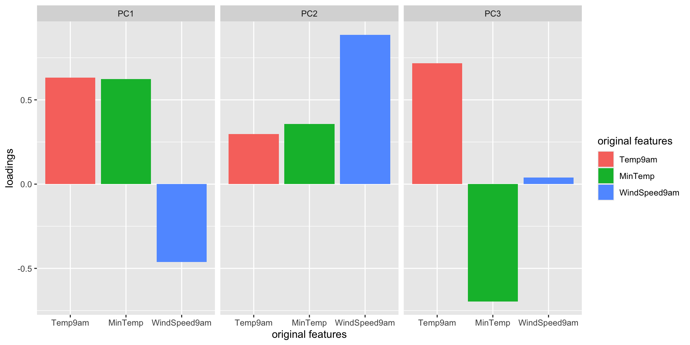
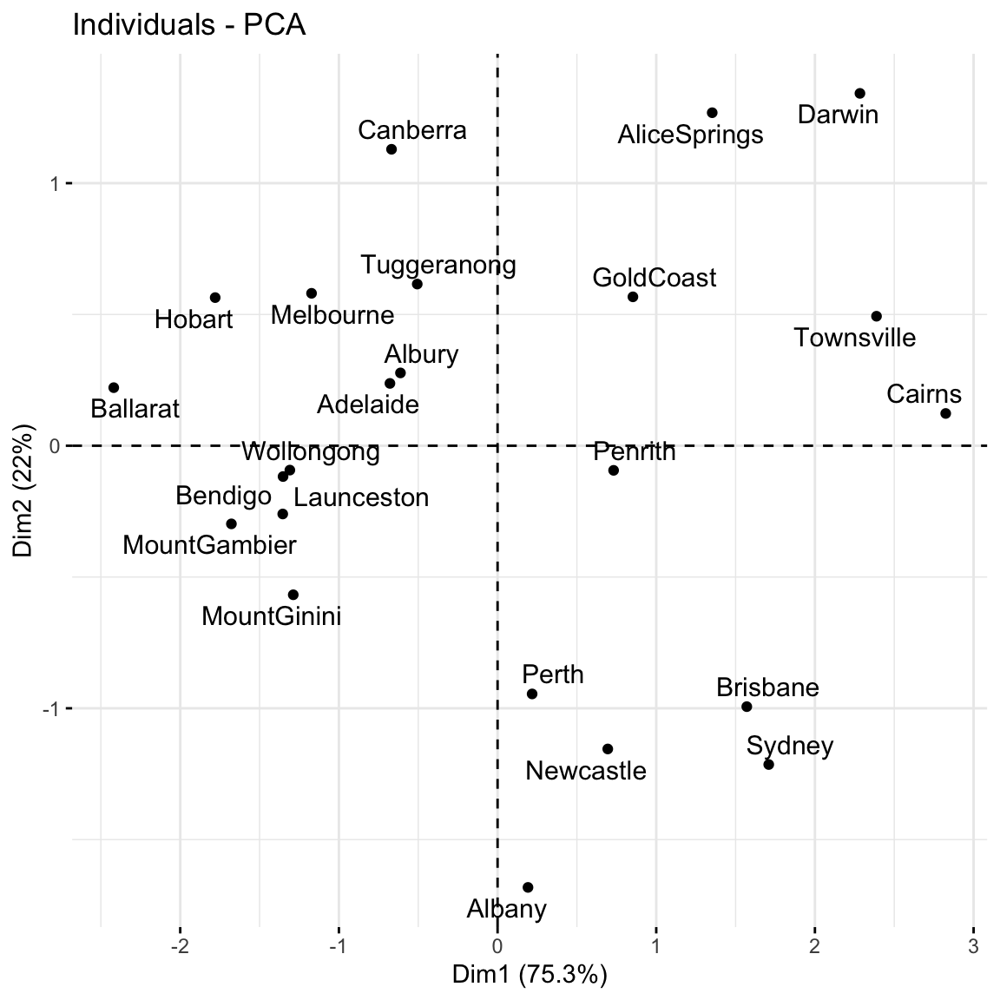
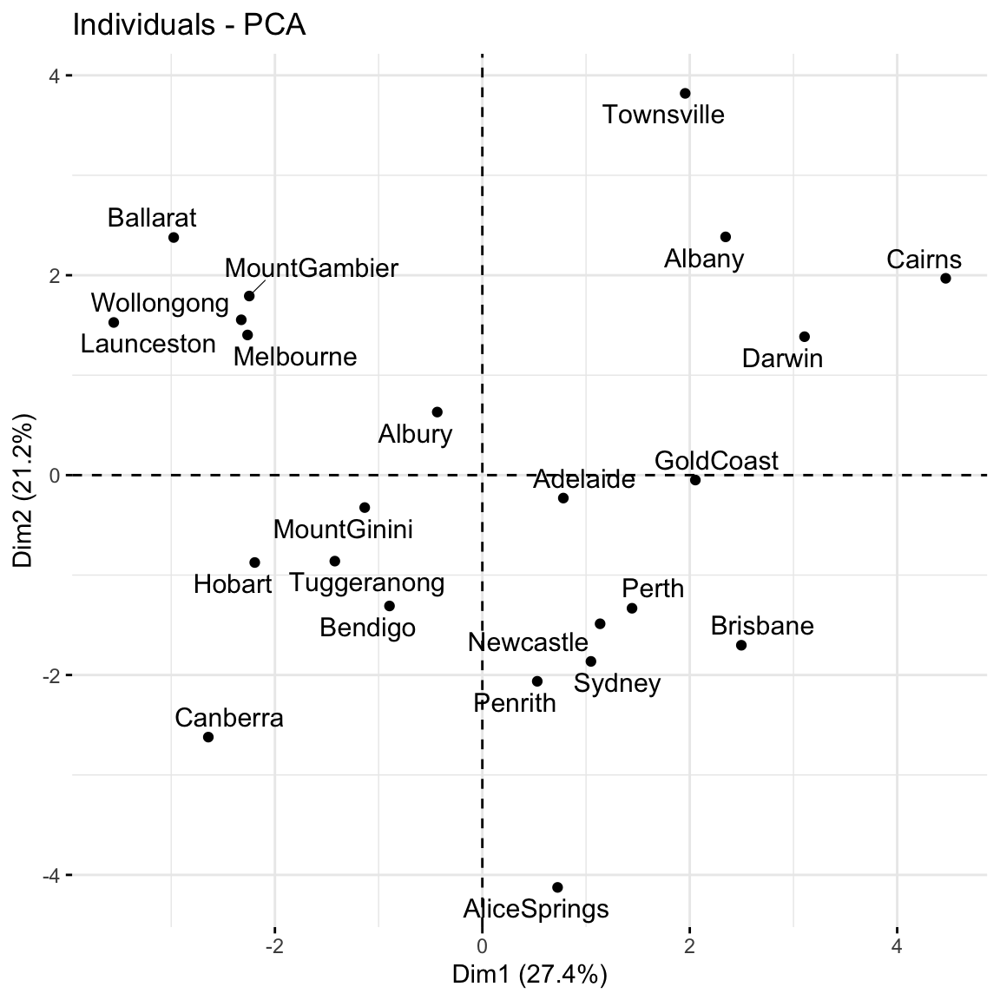

<!-- don't overwrite the notes doc! The exercise sections are different -->

<!-- NOTE: reading references rape, assault, etc :/ -->
<!-- > **READING**     -->
<!-- > For more on this topic, you can read [ISLR](https://drive.google.com/file/d/106d-rN7cXpyAkgrUqjcPONNCyO-rX7MQ/view) chapter 12.2. HOWEVER, please note that this section follows a sensitive application related to crime statistics. -->

<!-- pca vs factor analysis: pcs might not map onto any meaningful factor (eg: intelligence) -->

<!-- we can get back the original X after applying rotation -->
<!-- weather_data == 

head(as.matrix(weather_data) %*% as.matrix(pca_small$rotation)) -->


<!-- squared loadings sum to 1.  o.w. we could arbitrarily increase the loadings and blow up the variance -->

<!-- https://towardsdatascience.com/eigen-intuitions-understanding-eigenvectors-and-eigenvalues-630e9ef1f719#:~:text=The%20eigenvectors%20of%20a%20linear,scaled%20by%20under%20the%20transform. -->


<!-- http://www.sthda.com/english/articles/31-principal-component-methods-in-r-practical-guide/118-principal-component-analysis-in-r-prcomp-vs-princomp/ -->


<!-- plot(ratings) -->
<!-- scores <- prcomp(ratings, scale = FALSE)$x -->
<!-- pairs(scores) -->
<!-- cor(prcomp(ratings, scale = FALSE)$x) -->
<!-- data.frame(prcomp(ratings, scale = FALSE)$x) %>%  -->
<!--   summarize(mean(PC1^2), mean(PC2^2), mean(PC3^2)) -->
<!-- ggplot(data.frame(scores), aes(x = PC1, y = PC2)) +  -->
<!--   geom_point() + -->
<!--   theme(text = element_text(size = 16)) -->


# Settling In {-}

- Sit with your NEW group and introduce yourselves
- Prepare to take notes (find the QMD template in the usual spot)
- Catch up on any announcements you've missed on Slack

\
\
\
\

# Notes: PCA {-}

## Context {.unnumbered .smaller}

{width=90%}


In **unsupervised learning** we don't have any y outcome variable, we're just exploring the structure of our data.
This can be divided into 2 types of tasks:

- **clustering**    
    - GOAL: examine structure & similarities among the individual observations (rows) of our dataset
    - METHODS: hierarchical and K-means clustering
    
- **dimension reduction**    
    - GOAL: examine & simplify structure among the features (columns) of our dataset
    - METHODS: principal components analysis (and many others, including singular value decomposition (SVD), Uniform Manifold Approximation and Projection (UMAP))
    


## Dimension Reduction Motivation {.unnumbered .smaller}

Especially when we have a *lot* of features, dimension reduction helps:

       
- identify patterns among the features
- conserve computational resources
- **feature engineering**: create salient features to use in regression & classification (will discuss next class)


## Principal Component Analysis (PCA) {-} 


## Example {.unnumbered .smaller}

PCA is pretty cool.

Check out this article ["Genes mirror geography in Europe"](https://www.ncbi.nlm.nih.gov/pmc/articles/PMC2735096/) which examined more than 500,000 DNA sites on 3,000 Europeans.

Thus we have high dimensional data with 3,000 rows (n) and 500,000 columns (p), thus p > n.
We can capture much of the geographic relationship by reducing these 500,000 features to just 2 principal components! 


## PCA Details {.unnumbered .smaller}

::: {.content-visible when-profile="book"}
**NOTE**

The section here provides a general overview of the PCA algorithm.
The details require linear algebra, which is not a pre-req for this course.
If you're curious, more details are provided in the Deeper Learning section below.

<br>


**PRINCIPAL COMPONENT ANALYSIS**    
:::

Suppose we start with high dimensional data with p *correlated* features: $x_1$, $x_2$, ..., $x_p$.

. . .

We want to turn these into a *smaller* set of k < p features or *principal components* $PC_1$, $PC_2$, …., $PC_k$ that: 

- are *uncorrelated* (i.e. each contain *unique* information)
- preserve the majority of information or variability in the original data

. . .

**Step 1**    
Define the p principal components as **linear combinations** of the original x features.
These combinations are specified by **loadings** or coefficients a:    

$$\begin{split}
PC_1 & = a_{11} x_1 + a_{12} x_2 + \cdots + a_{1p} x_p \\
PC_2 & = a_{21} x_1 + a_{22} x_2 + \cdots + a_{2p} x_p \\
\vdots & \\
PC_p & = a_{p1} x_1 + a_{p2} x_2 + \cdots + a_{pp} x_p \\
\end{split}$$    

. . .

The **first PC** $PC_1$ is the direction of maximal variability -- it retains the greatest variability or information in the original data.

The subsequent PCs are defined to have maximal variation among the directions orthogonal to /  perpendicular to / uncorrelated with the previously constructed PCs.    

. . .


**Step 2**    

Keep only the subset of PCs which retain "enough" of the variability / information in the original dataset.


\
\
\
\


# Small Group Discussion {-}

## Data Details {.unnumbered .smaller}

Recall the Australian weather data from earlier this semester:


::: {.cell}

```{.r .cell-code  code-fold="true"}
# Import the data and load some packages
library(tidyverse)
library(rattle)
data(weatherAUS)
head(weatherAUS)
```

::: {.cell-output .cell-output-stdout}

```
# A tibble: 6 × 24
  Date       Location MinTemp MaxTemp Rainfall Evaporation Sunshine WindGustDir
  <date>     <chr>      <dbl>   <dbl>    <dbl>       <dbl>    <dbl> <ord>      
1 2008-12-01 Albury      13.4    22.9      0.6          NA       NA W          
2 2008-12-02 Albury       7.4    25.1      0            NA       NA WNW        
3 2008-12-03 Albury      12.9    25.7      0            NA       NA WSW        
4 2008-12-04 Albury       9.2    28        0            NA       NA NE         
5 2008-12-05 Albury      17.5    32.3      1            NA       NA W          
6 2008-12-06 Albury      14.6    29.7      0.2          NA       NA WNW        
# ℹ 16 more variables: WindGustSpeed <dbl>, WindDir9am <ord>, WindDir3pm <ord>,
#   WindSpeed9am <dbl>, WindSpeed3pm <dbl>, Humidity9am <int>,
#   Humidity3pm <int>, Pressure9am <dbl>, Pressure3pm <dbl>, Cloud9am <int>,
#   Cloud3pm <int>, Temp9am <dbl>, Temp3pm <dbl>, RainToday <fct>,
#   RISK_MM <dbl>, RainTomorrow <fct>
```


:::
:::


. . .

Note that the data has some missing values:


::: {.cell}

```{.r .cell-code}
colSums(is.na(weatherAUS))
```

::: {.cell-output .cell-output-stdout}

```
         Date      Location       MinTemp       MaxTemp      Rainfall 
            0             0          3285          3085          5930 
  Evaporation      Sunshine   WindGustDir WindGustSpeed    WindDir9am 
       109530        118202         15766         15659         16135 
   WindDir3pm  WindSpeed9am  WindSpeed3pm   Humidity9am   Humidity3pm 
         8668          3842          7254          4351          8329 
  Pressure9am   Pressure3pm      Cloud9am      Cloud3pm       Temp9am 
        23000         22981         89076         95092          3310 
      Temp3pm     RainToday       RISK_MM  RainTomorrow 
         7310          5930          5929          5929 
```


:::
:::


PCA cannot handle missing values.

We *could* simply eliminate days with any missing values, but this would kick out a lot of useful info.

. . .

Instead, we'll use KNN to *impute* the missing values using the `VIM` package.


::: {.cell}

```{.r .cell-code}
# If your VIM package works, use this chunk to process the data
library(VIM)

# It would be better to impute before filtering & selecting
# BUT it's very computationally expensive in this case
weather_temp <- weatherAUS %>% 
  filter(Date == "2008-12-01") %>% 
  dplyr::select(-Date, -RainTomorrow, -Temp3pm, -WindGustDir, -WindDir9am, -WindDir3pm) %>% 
  VIM::kNN(imp_var = FALSE)

# Now convert Location to the row name (not a feature)
weather_temp <- weather_temp %>% 
  column_to_rownames("Location") 

# Create a new data frame that processes logical and factor features into dummy variables
weather_data <- data.frame(model.matrix(~ . - 1, data = weather_temp))
rownames(weather_data) <- rownames(weather_temp)
```
:::


<!-- data from Brianna are almost identical to above, but one entry is different? -->

::: {.content-visible when-profile="book"}
If your VIM package doesn't work, import the processed data from here:


::: {.cell}

```{.r .cell-code}
weather_data <- read.csv("https://kegrinde.github.io/stat253_coursenotes/data/weatherAUS_processed_subset.csv") %>% 
  column_to_rownames("Location")
```
:::

:::


## EXAMPLE 1: Research goals {.unnumbered .smaller}

Check out the `weather_data`:


::: {.cell}

```{.r .cell-code}
head(weather_data)
```

::: {.cell-output .cell-output-stdout}

```
           MinTemp MaxTemp Rainfall Evaporation Sunshine WindGustSpeed
Albury        13.4    22.9      0.6         7.4     10.1            44
Newcastle     13.2    27.2      0.0         7.4     13.0            44
Penrith       15.2    32.6      0.0         7.4     10.9            59
Sydney        17.6    31.3      0.0         7.6     10.9            44
Wollongong     9.5    17.9      0.4         6.8     10.1            52
Canberra      13.6    25.2      0.0         9.6     13.0            80
           WindSpeed9am WindSpeed3pm Humidity9am Humidity3pm Pressure9am
Albury               20           24          71          22      1007.7
Newcastle             6           19          50          24      1013.9
Penrith              13           22          35          23      1009.1
Sydney                2           24          29          21      1009.1
Wollongong           20           24          52          44      1007.9
Canberra             26           43          31          28      1006.3
           Pressure3pm Cloud9am Cloud3pm Temp9am RainTodayNo RainTodayYes
Albury          1007.1        8        5    16.9           1            0
Newcastle       1010.1        3        4    21.8           1            0
Penrith         1007.1        3        4    24.4           1            0
Sydney          1004.6        3        7    24.9           1            0
Wollongong      1003.3        5        5    14.0           0            1
Canberra        1004.4        1        6    19.9           1            0
           RISK_MM
Albury           0
Newcastle        0
Penrith          0
Sydney           0
Wollongong       0
Canberra         0
```


:::
:::


a. Identify a research goal that could be addressed using one of our **clustering** algorithms.

b. Identify a research goal that could be addressed using our **PCA** dimension reduction algorithm.


<details>
<summary>Solution:</summary>
a. What cities are similar w.r.t. their weather patterns?
b. How can we *combine* these correlated weather features into a smaller set? (for the purpose of supervised learning, computational efficiency, etc.)
</details>
<br>

## EXAMPLE 2: Starting small {.unnumbered .smaller}

Let's start with just 3 *correlated* features:
$x_1$ (Temp9am), $x_2$ (MinTemp), and $x_3$ (WindSpeed9am)


::: {.cell}

```{.r .cell-code  code-fold="true"}
small_example <- weather_data %>% 
  select(Temp9am, MinTemp, WindSpeed9am)

pairs(small_example)
```

::: {.cell-output-display}
{width=480}
:::
:::


The goal of PCA will be to *combine* these correlated features into a *smaller* set of **uncorrelated** principal components (PCs) without losing a significant amount of information.

a. The first PC will be defined to retain the greatest variability, hence information in the original features. What do you expect the first PC to be like?

b. How many PCs do you think we'll need to keep without losing too much of the original information?

<details>
<summary>Solution:</summary>
a. We might expect it to be driven by Temp9am and MinTemp which are strongly correlated.
b. Maybe 2? PC1 might contain strong info about the temp features and PC2 might contain strong info about wind.
</details>
<br>


## EXAMPLE 3: Defining the PCs {.unnumbered .smaller}

Perform a PCA on the `small_example` data:


::: {.cell}

```{.r .cell-code}
# This code is nice and short!
# scale = TRUE, center = TRUE first standardizes the features
pca_small <- prcomp(small_example, scale = TRUE, center = TRUE)
```
:::


This creates 3 PCs which are each different *combinations* of the (standardized) original features:


::: {.cell}

```{.r .cell-code}
# Original (standardized) features
scale(small_example) %>% 
  head()
```

::: {.cell-output .cell-output-stdout}

```
               Temp9am     MinTemp WindSpeed9am
Albury     -0.49164877 -0.10016777    0.5179183
Newcastle   0.25610853 -0.13455372   -1.3350783
Penrith     0.65287772  0.20930578   -0.4085800
Sydney      0.72917948  0.62193718   -1.8645059
Wollongong -0.93419901 -0.77069379    0.5179183
Canberra   -0.03383817 -0.06578182    1.3120597
```


:::

```{.r .cell-code}
# PCs
pca_small %>% 
  pluck("x") %>% 
  head()
```

::: {.cell-output .cell-output-stdout}

```
                  PC1         PC2         PC3
Albury     -0.6119817  0.27733759 -0.26182765
Newcastle   0.6944764 -1.15487603  0.22381760
Penrith     0.7312569 -0.09374376  0.30573078
Sydney      1.7089610 -1.21413476  0.01482615
Wollongong -1.3091122 -0.09282229 -0.11200583
Canberra   -0.6683498  1.12907017  0.07404101
```


:::
:::


Specifically, these PCs are *linear combinations* of the (standardized) original x features, defined by **loadings** a:

$PC_1 = a_{11}x_1 + a_{12}x_2 + a_{13}x_3$

$PC_2 = a_{21}x_1 + a_{22}x_2 + a_{23}x_3$

$PC_3 = a_{31}x_1 + a_{32}x_2 + a_{33}x_3$


And these linear combinations are defined so that the PCs are *uncorrelated*, thus each contain *unique* weather information about the cities!


::: {.cell}

```{.r .cell-code  code-fold="true"}
pca_small %>% 
  pluck("x") %>% 
  pairs()
```

::: {.cell-output-display}
{width=480}
:::
:::


a. Use the loadings below to specify the formula for the first PC.    
    
    PC1 = ___*Temp9am + ___*MinTemp + ___*WindSpeed9am
  

::: {.cell}

```{.r .cell-code}
pca_small %>% 
  pluck("rotation")
```

::: {.cell-output .cell-output-stdout}

```
                    PC1       PC2         PC3
Temp9am       0.6312659 0.2967160  0.71656333
MinTemp       0.6230387 0.3562101 -0.69637431
WindSpeed9am -0.4618725 0.8860440  0.03999775
```


:::
:::


b. For just the first city, confirm that its PC1 coordinate or **score** can be calculated from its original coordinates using the formula in part a: 
    

::: {.cell}

```{.r .cell-code}
# Original (standardized) coordinates
scale(small_example) %>% 
  head(1)
```

::: {.cell-output .cell-output-stdout}

```
          Temp9am    MinTemp WindSpeed9am
Albury -0.4916488 -0.1001678    0.5179183
```


:::

```{.r .cell-code}
# PC coordinates
pca_small %>%   
  pluck("x") %>% 
  head(1)
```

::: {.cell-output .cell-output-stdout}

```
              PC1       PC2        PC3
Albury -0.6119817 0.2773376 -0.2618276
```


:::
:::

    
    


<details>
<summary>Solution:</summary>
a. PC1 = 0.6312659 Temp9am + 0.6230387 MinTemp - 0.4618725 WindSpeed9am
b.


::: {.cell}

```{.r .cell-code}
(0.6312659 * -0.4916488)  + (0.6230387 * -0.1001678) - (0.4618725 * 0.5179183)
```
:::

</details>
<br>


## EXAMPLE 4: Examining the components of each PC (part 1) {.unnumbered .smaller}

Plots can help us interpret the above numerical loadings, hence the important components of each PC.


::: {.cell}

```{.r .cell-code  code-fold="true"}
# Plot the loadings for all 3 PCs
library(reshape2)
melt(pca_small$rotation[, 1:3]) %>% 
  ggplot(aes(x = Var1, y = value, fill = Var1)) +
    geom_bar(stat = "identity") +
    facet_wrap(~ Var2) + 
    labs(y = "loadings", x = "original features", fill = "original features")
```

::: {.cell-output-display}
{width=960}
:::
:::


::: {.content-visible when-profile="book"}

::: {.cell}

```{.r .cell-code  code-fold="true"}
# Focus on the 1st PC (this will be helpful when we have more PCs!)
melt(pca_small$rotation) %>%
  filter(Var2 == "PC1") %>% 
  ggplot(aes(x = Var1, y = value, fill = Var1)) +
    geom_bar(stat = "identity") +
    labs(y = "loadings", x = "original features", fill = "original features")
```

::: {.cell-output-display}
{width=768}
:::
:::

:::


a. Which features contribute the most, either positively or negatively, to the first PC?

b. What about the second PC?


<details>
<summary>Solution:</summary>
a. PC1 is driven primarily by Temp9am and MinTemp (positively) and with contrast to WindSpeed9am (negatively)
b. PC2 is driven primarily by WindSpeed9am (positively)
</details>
<br>


## EXAMPLE 5: Examining the components of each PC (part 2) {.unnumbered .smaller}

When we have a lot of features x, the above plots get messy.
A **loadings plot** or **correlation circle** is another way to visualize PC1 and PC2 (the most important PCs):

- each *arrow* represents a feature x
- the x-coordinate of an arrow reflects the *correlation* between x and PC1
- the y-coordinate of an arrow reflects the *correlation* between x and PC2
- arrow *length* reflects how much the feature contributes to the first 2 PCs 

It is powerful in that it can provide a 2-dimensional visualization of high dimensional data (just 3 dimensions in our small example here)!   
  


::: {.cell}

```{.r .cell-code  code-fold="true"}
library(factoextra)
fviz_pca_var(pca_small, repel = TRUE)
```

::: {.cell-output-display}
{width=576}
:::
:::


a. Positively correlated features point in similar directions. The opposite is true for negatively correlated features. What do you learn here?

b. Which features are most highly correlated with, hence contribute the most to, the first PC (x-axis)? (Is this consistent with what we observed in the earlier plots?)

c. What about the second PC? 


<details>
<summary>Solution:</summary>
a. Temp9am and MinTemp are highly positively correlated; Windspeed9am seems to have a negative relationship with temperature
b. Temp9am and MinTemp primarily contribute to PC1 with a bit of negative contrast with WindSpeed9am
c. WindSpeed9am contributes to PC2
</details>
<br>


## EXAMPLE 6: Examining the amount of information captured by each PC (numerical metrics) {.unnumbered .smaller}

Now that we better understand the *structures* of the PCs, let's examine the relative amount of information they each capture from the original set of features:


::: {.cell}

```{.r .cell-code}
# Load package for tidy table
library(tidymodels)

# Measure information captured by each PC
# Calculate variance from standard deviation
pca_small %>% 
  tidy(matrix = "eigenvalues") %>% 
  mutate(var = std.dev^2)
```

::: {.cell-output .cell-output-stdout}

```
# A tibble: 3 × 5
     PC std.dev percent cumulative    var
  <dbl>   <dbl>   <dbl>      <dbl>  <dbl>
1     1   1.50   0.753       0.753 2.26  
2     2   0.812  0.220       0.973 0.660 
3     3   0.284  0.0268      1     0.0805
```


:::
:::


NOTE:

- `var` = amount of variability, hence information, in the original features captured by each PC
- `percent` = % of original information captured by each PC
- `cumulative` = cumulative % of original information captured by the PCs

a. What % of the original information is captured by PC1? Confirm using both the `var` and `percent` columns.


::: {.cell}

:::


b. What % of the original information is captured by PC2?


c. In total, 100% of the original information is captured by PC1, PC2, and PC3. What % of the original info would we retain if we only kept PC1 and PC2, i.e. if we reduced the PC dimensions by 1? Confirm using both the `percent` and `cumulative` columns.


::: {.cell}

:::


<details>
<summary>Solution:</summary>
a. 75.3%        


::: {.cell}

```{.r .cell-code}
2.26 / (2.26 + 0.660 + 0.0805)
```

::: {.cell-output .cell-output-stdout}

```
[1] 0.7532078
```


:::
:::


b. 22.0%
c. 97.3%


::: {.cell}

```{.r .cell-code}
0.753 + 0.220
```

::: {.cell-output .cell-output-stdout}

```
[1] 0.973
```


:::
:::

    
</details>
<br>


## EXAMPLE 7: Examining the amount of information captured by each PC (SCREE plots) {.unnumbered .smaller}

Especially when we start with lots of features, graphical summaries of the above tidy summary can help understand the variation captured by the PCs:


::: {.cell}

```{.r .cell-code  code-fold="true"}
# SCREE PLOT: % of variance explained by each PC
pca_small %>% 
  tidy(matrix = "eigenvalues") %>% 
  ggplot(aes(y = percent, x = PC)) + 
    geom_point(size = 2) + 
    geom_line() + 
    labs(y = "% of variance explained")
```

::: {.cell-output-display}
{width=960}
:::
:::

::: {.cell}

```{.r .cell-code  code-fold="true"}
# Cumulative % of variance explained
pca_small %>% 
  tidy(matrix = "eigenvalues") %>% 
  rbind(0) %>% 
  ggplot(aes(y = cumulative, x = PC)) + 
    geom_point(size = 2) + 
    geom_line() + 
    labs(y = "CUMULATIVE % of variance explained")
```

::: {.cell-output-display}
{width=960}
:::
:::

    

Based on these summaries, how many and which of the 3 PCs does it make sense to keep?

Thus by how much can we reduce the dimensions of our dataset?  


<details>
<summary>Solution:</summary>
2 (maybe 1). The first 2 PCs account for nearly 100% of the variance. (The first PC alone also accounts for a lot, and maybe enough depending upon our research goals.)
</details>
<br>


## EXAMPLE 8: Examining the new PC coordinates of the data points (score plots) {.unnumbered .smaller}

Finally, now that we better understand the "meaning" of our 3 new PCs, let's explore their outcomes for each city (row) in the dataset.

::: {.content-visible when-profile="book"}
The below **scores** provide the new coordinates with respect to the 3 PCs:


::: {.cell}

```{.r .cell-code}
pca_small %>% 
  pluck("x") %>% 
  head()
```

::: {.cell-output .cell-output-stdout}

```
                  PC1         PC2         PC3
Albury     -0.6119817  0.27733759 -0.26182765
Newcastle   0.6944764 -1.15487603  0.22381760
Penrith     0.7312569 -0.09374376  0.30573078
Sydney      1.7089610 -1.21413476  0.01482615
Wollongong -1.3091122 -0.09282229 -0.11200583
Canberra   -0.6683498  1.12907017  0.07404101
```


:::
:::

:::

A **score plot** maps out the scores of the first, and most important, 2 PCs for each city.
PC1 is on the x-axis and PC2 on the y-axis.

::: {.content-visible when-profile="book"}
Again, since these PCs are linear combinations of all original features (only 3 here), a score plot can provide a 2-dimensional visualization of high dimensional data!
:::

**Question:** Unless you're familiar with Australian geography, it might be tough to ascertain any meaningful patterns here. 
Looking back to the map, and recalling the key information captured by PC1 and PC2, does there appear to be any geographical explanation of which cities are similar with respect to their PC1 and PC2 scores?


::: {.cell}

```{.r .cell-code  code-fold="true"}
# Score plot: plot PC1 scores (x-axis) vs PC2 scores (y-axis) of all data points
fviz_pca_ind(pca_small, repel = TRUE)
```

::: {.cell-output-display}
{width=576}
:::
:::


<details>
<summary>Solution:</summary>
will vary. it's not obvious to me personally! Some students have shared that more northern (warmer) cities tend to be "clustered". Ditto southern (cooler) cities.
</details>
<br>


## EXAMPLE 9: PCA using all features {.unnumbered .smaller}

Repeat the PCA using all 18 original features in the `weather_data`, our goal being to reduce the dimensions of this dataset while still maintaining a "sufficient" amount of the original information!


::: {.cell}

```{.r .cell-code}
pca_weather <- prcomp(weather_data, scale = TRUE, center = TRUE)
```
:::


This produces 18 *uncorrelated* PCs that are linear combinations of the original (standardized) features:


::: {.cell}

```{.r .cell-code}
pca_weather %>% 
  pluck("x") %>% 
  head()
```

::: {.cell-output .cell-output-stdout}

```
                  PC1        PC2         PC3         PC4         PC5        PC6
Albury     -0.4347320  0.6310084 -0.00249586  1.58334640 -0.75416235  0.5584570
Newcastle   1.1354168 -1.4874342 -1.68801307 -0.08843211 -0.29711827 -0.3570227
Penrith     0.5295179 -2.0629031  0.31172583 -0.40979567 -0.55894823  0.2923958
Sydney      1.0471702 -1.8638332  0.90468479 -0.19738978 -1.36015610 -0.7805383
Wollongong -2.3244856  1.5540074  0.07924589  0.03387889  0.08171723 -0.2007186
Canberra   -2.6420711 -2.6213046  0.97957591 -0.87130315 -1.63498832  0.3104203
                  PC7        PC8         PC9       PC10         PC11
Albury     -0.5030481 -1.0032728  1.49263281 -0.3770739  0.217419531
Newcastle  -0.5342649 -0.8260785 -0.12901337  0.5524187 -0.019147225
Penrith     0.1669854 -0.5264088 -0.03359561  0.0720234  0.003082526
Sydney     -1.4130771 -1.1624668 -1.05279963 -0.1089470 -0.059738227
Wollongong  0.5253852 -0.7279453 -0.64889066 -0.3814026  0.264308869
Canberra   -0.7598967  1.5625904  0.32417904  1.1590349  0.106050706
                  PC12       PC13          PC14        PC15        PC16
Albury     -0.91098812  0.3093372 -0.1194868349 -0.04732443  0.20006422
Newcastle  -0.31768269 -0.3689492 -0.0020756144 -0.25958440 -0.12764212
Penrith    -0.01413404  0.5423686  0.0751576394  0.11900530 -0.18078633
Sydney      0.37396249  0.1287991 -0.0270416392  0.30938838  0.06210685
Wollongong  0.95247931 -0.1039939  0.2175806676 -0.29571978 -0.03130589
Canberra    0.02913232 -0.3468298 -0.0001989966 -0.05693145  0.10311335
                  PC17          PC18
Albury     -0.10798959 -1.356546e-17
Newcastle   0.14708667  9.745684e-17
Penrith     0.22254521 -1.245878e-16
Sydney     -0.09870755 -2.356101e-16
Wollongong -0.18911254  5.790386e-17
Canberra   -0.03666081 -2.911212e-16
```


:::
:::


a. Suppose we wanted to retain at least 80% of the information in the original 18 features. What's the smallest number of PCs we need to keep? *Thus how much can we reduce the original dimensions?*


::: {.cell}

```{.r .cell-code}
# Cumulative % of variance explained (in numbers)
pca_weather %>% 
  tidy(matrix = "eigenvalues")
```

::: {.cell-output .cell-output-stdout}

```
# A tibble: 18 × 4
      PC  std.dev percent cumulative
   <dbl>    <dbl>   <dbl>      <dbl>
 1     1 2.22e+ 0 0.274        0.274
 2     2 1.95e+ 0 0.212        0.486
 3     3 1.62e+ 0 0.146        0.632
 4     4 1.40e+ 0 0.109        0.741
 5     5 1.12e+ 0 0.0696       0.810
 6     6 9.25e- 1 0.0475       0.858
 7     7 8.32e- 1 0.0385       0.896
 8     8 6.90e- 1 0.0265       0.923
 9     9 6.46e- 1 0.0232       0.946
10    10 5.68e- 1 0.0179       0.964
11    11 4.86e- 1 0.0131       0.977
12    12 4.60e- 1 0.0118       0.989
13    13 3.05e- 1 0.00517      0.994
14    14 2.33e- 1 0.00301      0.997
15    15 1.71e- 1 0.00163      0.998
16    16 1.28e- 1 0.00091      0.999
17    17 1.04e- 1 0.0006       1    
18    18 1.34e-16 0            1    
```


:::
:::

::: {.cell}

```{.r .cell-code}
# Cumulative % of variance explained (plot)
pca_weather %>% 
  tidy(matrix = "eigenvalues") %>% 
  rbind(0) %>%     
  ggplot(aes(y = cumulative, x = PC)) + 
  geom_point(size = 2) + 
  geom_line() 
```

::: {.cell-output-display}
{width=960}
:::
:::

    


b. Check out some plots of the loadings in the more important PCs. Describe the general properties of the first 2 PCs. What original features do they most capture?        


::: {.cell}

```{.r .cell-code}
# Plot the loadings for first 5 PCs  
# We have to use a different color palette -- we need enough colors for our 18 features
pca_weather$rotation %>% as.data.frame() %>% select(PC1:PC5) %>% rownames_to_column(var = 'Variable') %>% pivot_longer(PC1:PC5 ,names_to = 'PC', values_to = 'Value') %>% 
  ggplot(aes(x = Variable, y = Value, fill = Variable)) +
    geom_bar(stat = "identity") +
    facet_wrap(~ PC) + 
    labs(y = "loadings", x = "original features", fill = "original features") + 
    scale_fill_manual(values = rainbow(18)) + 
    theme(axis.title.x=element_blank(),
        axis.text.x=element_blank(),
        axis.ticks.x=element_blank())
```

::: {.cell-output-display}
{width=768}
:::
:::

::: {.cell}

```{.r .cell-code}
# Loadings plot: first 2 PCs
fviz_pca_var(pca_weather, repel = TRUE)
```

::: {.cell-output-display}
{width=576}
:::
:::


c. Finally, check out the **score plot** for the first 2 PCs. Does there appear to be any geographical explanation of which cities are similar with respect to their PC1 and PC2 scores?       


::: {.cell}

```{.r .cell-code}
fviz_pca_ind(pca_weather, repel = TRUE)
```

::: {.cell-output-display}
{width=576}
:::
:::

    
    

<details>
<summary>Solution:</summary>
a. 5
b. first PC is driven by air related features such as windspeed, air pressure, and temperature. second PC is driven by water related features such as humidity and rain.
c. again, not obvious to me!
</details>


## EXAMPLE 10: Drawbacks {.unnumbered .smaller}

a. In what kind of scenario would you be relieved to have PCA as a tool?    
b. What are the drawbacks of PCA? When might you hesitate to use it?


<details>
<summary>Solution:</summary>
a. when we have lots and lots of features, we want to simplify the data set while retaining the information, and we don't care about losing the meaning of the original features.

b. if we're specifically interested in the original features (and don't want to combine them into tough to interpret PCs)

</details>

\
\
\
\

# Exercises {-}

**NOTE** 

These exercises are on HW6. The R code section below will be handy.

## {.unnumbered .smaller}


7.  **PCA Part 1**    
    There are quite a few features in the `candy_rankings` data. Let's do some dimension reduction. NOTE: One of the challenges of continuing to analyze the dataset using different techniques is that these techniques work differently, thus can require differently structured data. With this in mind, take care at the beginning this exercise to ensure that you're working with the original data (without any clustering info in it).        
    a. Construct PCA for the *original features* in `candy_rankings` with the following in mind:       
        - Do not include `winpercent` in your PCA
        - Do not include any new features (eg: cluster assignments) in your PCA      
    b. Construct a **score plot**.
    c. Provide two takeaways, or things you learned, from the score plot. NOTE: If you're unfamiliar with the candies, you might look back at their data.
    d. Are your observations about candies in part c consistent with your clustering conclusions? Explain what similarities or differences do you notice.


\
\


8. **PCA Part 2**       
    a. Construct a plot of the cumulative percent of the original information captured by the PCs.
    b. How many principal components do we need to keep in order to retain at least 60% of the information in the 11 original candy features?
    c. Construct a **loadings plot** AND a bar plot of the loadings for the first 2 PCs.
    d. Highlight *one* pair of the original features that are positively correlated **AND** one pair that are negatively correlated.
    e. Point out at least 2 original features that contribute most strongly (positively or negatively) to the first principal component. If you notice any theme to these features, say so.
    
    


\
\
\
\

# Wrapping Up {.unnumbered .smaller}

- As usual, take time after class to finish any remaining exercises, check solutions, reflect on key concepts from today, and come to office hours with questions
- Upcoming due dates: 
  - Group Assignment 2: due **TONIGHT**
  - HW6 (**last one!!**): due Wednesday after break (Dec 4)
  - Quiz 2 Revisions: bring to class Thursday after break (Dec 5)

\
\
\
\

# Notes: R code {-}

## {.unnumbered .smaller}

Suppose we have a set of `sample_data` with multiple feature columns x, and (possibly) a column named `id` which labels each data point.


::: {.cell}

```{.r .cell-code}
# Install packages
library(tidyverse)
```
:::


\

**PROCESS THE DATA**

If there's a column that's an identifying variable or label, not a feature of the data points, convert it to a row name.


::: {.cell}

```{.r .cell-code}
sample_data <- sample_data %>% 
  column_to_rownames("id")
```
:::


PCA can't handle NA values! There are a couple options.


::: {.cell}

```{.r .cell-code}
# Omit missing cases (this can be bad if there are a lot of missing points!)
sample_data <- na.omit(sample_data)

# Impute the missing cases
library(VIM)
sample_data <- sample_data %>%
  VIM::kNN(imp_var = FALSE)
```
:::


IF you have at least 1 *categorical* / factor feature, you'll need to pre-process the data even further.
You should NOT do this if you have *quantitative* and/or *logical* features.


::: {.cell}

```{.r .cell-code}
# Turn categorical features into dummy variables
sample_data <- data.frame(model.matrix(~ . - 1, sample_data))
```
:::


\
\


**RUN THE PCA**


::: {.cell}

```{.r .cell-code}
# scale = TRUE, center = TRUE first standardizes the features
pca_results <- prcomp(sample_data, scale = TRUE, center = TRUE)
```
:::


\
\


**CHECK OUT THE PCs**


::: {.cell}

```{.r .cell-code}
# Get the loadings which define the PCs
pca_results %>% 
  pluck("rotation")

# Plot loadings for first "k" PCs (you pick k)
library(reshape2)
melt(pca_results$rotation[, 1:k]) %>% 
  ggplot(aes(x = Var1, y = value, fill = Var1)) +
    geom_bar(stat = "identity") +
    facet_wrap(~ Var2) + 
    labs(y = "loadings", x = "original features", fill = "original features")

# Plot loadings for just the first PC
melt(pca_results$rotation) %>%
  filter(Var2 == "PC1") %>% 
  ggplot(aes(x = Var1, y = value, fill = Var1)) +
    geom_bar(stat = "identity") +
    labs(y = "loadings", x = "original features", fill = "original features")

# Loadings plot for first 2 PCs
library(factoextra)
fviz_pca_var(pca_results, repel = TRUE)
```
:::


\
\


**EXAMINE AMOUNT OF VARIABILITY / INFORMATION CAPTURED BY EACH PC**


::: {.cell}

```{.r .cell-code}
# Load package for tidy table
library(tidymodels)

# Numerical summaries: Measure information captured by each PC
pca_results %>% 
  tidy(matrix = "eigenvalues")

# Graphical summary 1: SCREE PLOT
# Plot % of variance explained by each PC
pca_results %>% 
  tidy(matrix = "eigenvalues") %>% 
  ggplot(aes(y = percent, x = PC)) + 
    geom_point(size = 2) + 
    geom_line() + 
    labs(y = "% of variance explained")

# Graphical summary 2: Plot cumulative % of variance explained by each PC
pca_results %>% 
  tidy(matrix = "eigenvalues") %>% 
  rbind(0) %>% 
  ggplot(aes(y = cumulative, x = PC)) + 
    geom_point(size = 2) + 
    geom_line() + 
    labs(y = "CUMULATIVE % of variance explained")
```
:::


\
\


**EXAMINE THE SCORES, i.e PC COORDINATES FOR THE DATA POINTS**


::: {.cell}

```{.r .cell-code}
# Numerical summary: check out the scores
pca_results %>% 
  pluck("x")

# Graphical summary: Score plot
# Plot PC1 scores (x-axis) vs PC2 scores (y-axis) of all data points
fviz_pca_ind(pca_results, repel = TRUE)
```
:::


\
\
\
\
\
\


# Deeper learning (OPTIONAL) {-}


**ALTERNATIVES TO PCA**

For more dimension reduction techniques, check out:

- [https://juliasilge.com/blog/billboard-100/](https://juliasilge.com/blog/billboard-100/)
- [https://www.analyticsvidhya.com/blog/2018/08/dimensionality-reduction-techniques-python/](https://www.analyticsvidhya.com/blog/2018/08/dimensionality-reduction-techniques-python/)


\
\


**MATH BEHIND PCA**

Let $X$ be our original (centered) $n \times p$ data matrix.
Mathematically, PCA produces an **orthogonal linear transformation** of $X$.
To this end, first note that the **covariance** or relationship among the features in $X$ is proportional to the $p \times p$ matrix

$$X^TX$$    

Further, we can express this covariance structure as

$$X^TX = W \Lambda W^T$$

where $W$ is a $p \times p$ matrix, the columns of which are eigenvectors of $X^TX$, and $\Lambda$ is a diagonal matrix of eigenvalues. 

- **principal components**    
    The $p$ principal components are defined by the columns of $W$.    
- **scores**    
    $XW$ maps the original data to the transformed data set, the columns of which are the scores (coordinates) for each of the PCs.    
- **loadings**    
    Scaling the columns of $W$, ie. multiplying them by the square root of the corresponding eigenvalue, gives the loadings.
- **proportion of variance explained by each principal component**    
    The eigenvalues in $\Lambda$ measure the relative proportion of variability that's explained by each principal component (eg: $\lambda_1 / (\lambda_1 + \cdots + \lambda_p)$).    

Alternatively, we can obtain the principal components via **singular value decomposition (SVD)**.
Instead of decomposing $X^TX$, SVD decomposes $X$.
In fact, this is a bit more computationally stable!  Specifically, SVD expresses $X$ as 

$$X = U \Sigma W^T$$    

where $U$ is an $n \times n$ matrix of orthogonal *left singular vectors* of $X$ and $\Sigma$ is an $n \times p$ diagonal matrix of *singular values*.  Then $W$ still provides the principal components and the diagonal of $\Sigma^2$ is equivalent to the diagonal of $\Lambda$ since by the SVD,    

$$X^TX = W \Sigma^T U^T U \Sigma W^T = W \Sigma^2 W^T$$

Further resource: [https://www.hackerearth.com/blog/developers/principal-component-analysis-with-linear-algebra/](https://www.hackerearth.com/blog/developers/principal-component-analysis-with-linear-algebra/)


